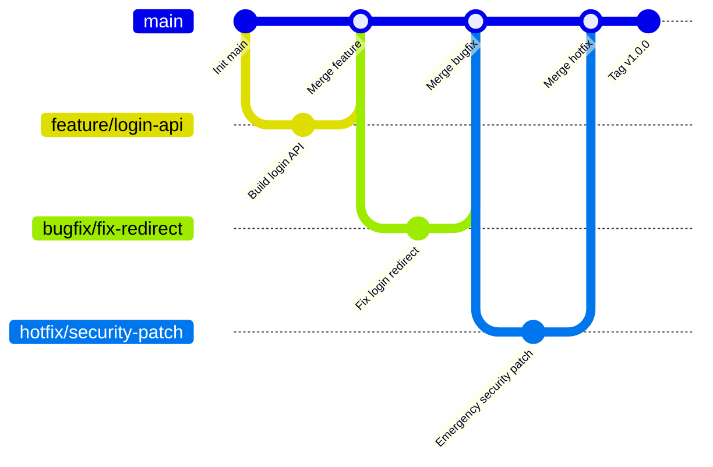

# Simplified Git Branch Workflow (Solo / Small Team)

This workflow is a simplified version of Git Flow. It is suitable for personal projects or small teams: structured but not heavy.

---

## 1. Main branch (long-lived)

- **`main`**
  - Always stable and release-ready
  - Production deployments come from here

> For small teams, `main` is usually enough; no need for `develop`.

---

## 2. Feature development (feature branch)

- Naming: `feature/<feature-name>`
- Purpose: build new features, then merge back to `main`

Examples:
```
feature/login-api
feature/user-profile
```

Flow:
```bash
# create feature branch from main
git checkout -b feature/login-api main

# merge back to main when done
git checkout main
git merge feature/login-api
git branch -d feature/login-api
```

---

## 3. Bug fixes (bugfix branch)

- Naming: `bugfix/<issue-name>`
- Purpose: fix bugs in dev/test

Example:
```
bugfix/fix-login-redirect
```

Same flow as feature branch, merge back to `main`.

---

## 4. Hotfixes (hotfix branch)

- Naming: `hotfix/<issue-name>`
- Purpose: urgent production fixes

Example:
```
hotfix/security-patch
```

Flow:
```bash
git checkout -b hotfix/security-patch main
# fix, commit
git checkout main
git merge hotfix/security-patch
git branch -d hotfix/security-patch
```

---

## 5. Releases (tags)

- Use **Git tags** for release versions
- No dedicated `release` branch required

Example:
```bash
git tag v1.0.0
git push origin v1.0.0
```

---

## Minimal recommended rules

1. Permanent branch: `main`
2. Temporary branches: `feature/...`, `bugfix/...`, `hotfix/...`
3. Use tags for releases, no separate release branch

---

## Branch lifecycle diagram


