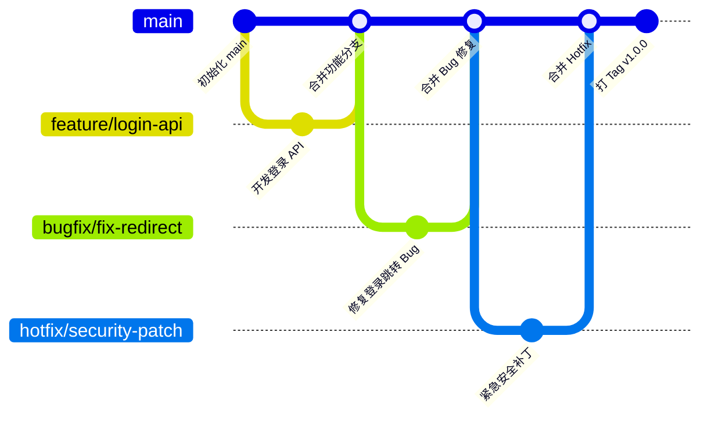

# 🌿 简化 Git 分支工作流（个人 / 小团队）

本工作流基于 Git Flow 精简而来，适合个人或小团队，既规范又不复杂。  

---

## 🚀 1. 主分支（长期分支）
- **`main`**
  - 永远保持稳定、可发布的状态。
  - 部署到生产环境的代码都来自这里。

> 对于小团队，通常只需要 `main`，不需要维护 `develop`。

---

## 🛠️ 2. 功能开发（Feature Branch）
- 分支命名：`feature/<功能名>`
- 用途：开发新功能，完成后合并回 `main`。

示例：
```

feature/login-api
feature/user-profile

````

流程：
```bash
# 从 main 创建功能分支
git checkout -b feature/login-api main

# 开发完成后，合并到 main
git checkout main
git merge feature/login-api
git branch -d feature/login-api
````

---

## 🐞 3. Bug 修复（Bugfix Branch）

* 分支命名：`bugfix/<问题名>`
* 用途：修复测试或开发环境的 bug。

示例：

```
bugfix/fix-login-redirect
```

流程同 feature 分支，完成后合并回 `main`。

---

## 🔥 4. 紧急修复（Hotfix Branch）

* 分支命名：`hotfix/<问题名>`
* 用途：生产环境出现严重问题时的快速修复。

示例：

```
hotfix/security-patch
```

流程：

```bash
git checkout -b hotfix/security-patch main
# 修复问题，提交
git checkout main
git merge hotfix/security-patch
git branch -d hotfix/security-patch
```

---

## 📦 5. 版本发布（Release / Tag）

* 如果需要版本管理，可以使用 **Git Tag** 标记发布版本。
* 不需要单独的 `release` 分支。

示例：

```bash
git tag v1.0.0
git push origin v1.0.0
```

---

## ✅ 最小可行规范（推荐）

1. 永久分支：`main`
2. 临时分支：`feature/...`、`bugfix/...`、`hotfix/...`
3. 发布用 **Git Tag**，不单独建 `release` 分支。

这样既规范，又不会增加太多复杂度。

---

## 📊 分支生命周期流程图




